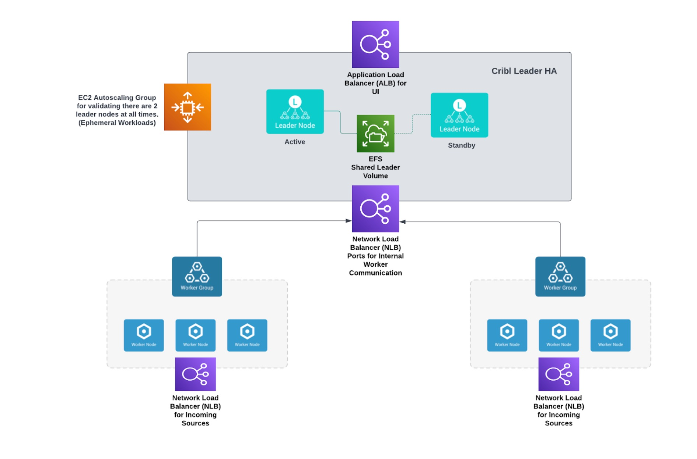

# Cribl HA Leader Cluster Automation

## Intro
The Terraform code included in this repo will build out a Cribl HA Leader cluster in an AWS account.
The following diagram describes how the Cribl HA Leader pair will be deployed in an Auto Scaling Group (ASG).

The Terraform code will:
 - Create the Application Load Balancer (ALB) config for the Leader UI
 - Create the Network Load Balancer (NLB) config for the leader/worker group communcation 
 - Create the shared EFS Volume (NFS) required by the Cribl HA setup.
 - Create the EC2 Lauch Config including User Data that will set up that shared mount point.
 - Define the Automatic Scaling Group (ASG) for the Cribl HA Leader nodes.
 - This will not create the Cribl Worker Groups.

## Inputs 
The Terraform Code Requires the following Inputs:

**AWS_VPC** (Required) - The VPC that the Leader Pair Config will deployed

**AWS_REGION** (Required) - The Region the Leader Pair will be deployed (ie. us-east-2)

**NUMOFINST** (Default: 2) - The number of Leader instances to deploy in the ASG

**SSHKEYNAME** (Required) - The name of the existing SSH Key Pair

**CRIBL_LIC** (Required) - The Cribl License Key. The HA Pair will not start correctly without this key.

## Outputs

*To be determined.*

## To Do's

 - Create the configuration for the NLB (Just haven't done it yet)
 - Identify and define the outputs for this Terraform Code
 - Create a Terraform Module (or include this code in an existing module)
